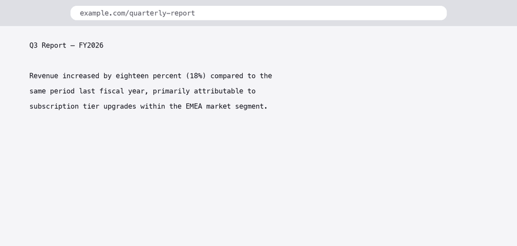

# Clean Copy MD — for Firefox

Copy any selected text as **clean, formatted Markdown** — right from your browser's right-click menu. No more messy pastes with broken styling, inline CSS junk, or lost formatting.

  



## What it does
 
Select text on any webpage → right-click → **Clean Copy**:

- Converts headings, bold, italic, links, lists (nested too), code blocks, blockquotes, definition lists and tables to proper Markdown
- **Table column alignment preserved** (v1.4.1): `text-align` styles become `:---` / `:---:` / `---:` separators
- Strips ads, scripts, hidden elements and inline styling
- Unescapes HTML entities so `&amp;` becomes `&`
- Copies straight to your clipboard as clean Markdown

Keyboard shortcut: <kbd>Ctrl+Shift+C</kbd> (Windows/Linux) / <kbd>Cmd+Shift+C</kbd> (Mac)

The popup also lets you paste-and-clean: drop in dirty HTML or messy text and get clean Markdown out.

This is the Firefox port of [Clean Copy](https://github.com/mahope/clean-copy) (Chrome). Same converter core, same features. Also available as a [CLI](https://github.com/mahope/clean-copy-cli) (`brew install clean-copy`) and an [Obsidian plugin](https://github.com/mahope/clean-copy-obsidian).

## Install from source (~30 seconds)

No build step. No dependencies. Plain JavaScript.

1. Download or clone this repository:
   ```bash
   git clone https://github.com/mahope/clean-copy-firefox.git
   ```
2. Open Firefox and go to `about:debugging#/runtime/this-firefox`
3. Click **Load Temporary Add-on…**
4. Select `manifest.json` in the cloned folder
5. Done — select some text, right-click, choose **Clean Copy**

Note: temporary add-ons are removed when Firefox restarts. A signed listing on addons.mozilla.org is planned.

## Privacy

Clean Copy does exactly one thing on the page you're looking at, when you ask it to. There is:

- **No analytics, no tracking, no telemetry**
- **No network requests** — nothing leaves your browser
- Declared data collection: **none** (`data_collection_permissions` in the manifest)

## Tests

```bash
node tools/test_clean_copy.js
```

## License

MIT
